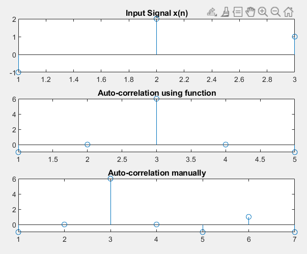
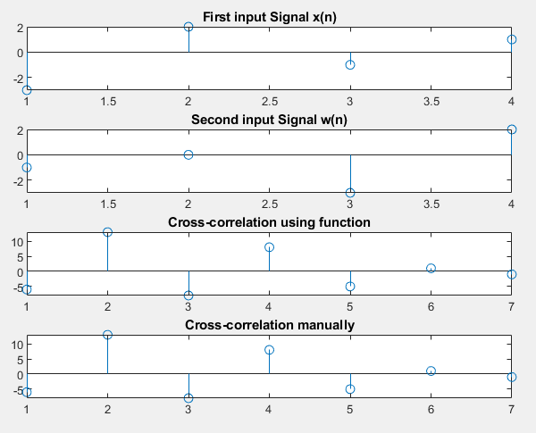

## Experiment Date : 07/05/23

## Experiment No : 03

## Experiment Name:

## Study of Correlation Using MATLAB.

---

## Theory :

<div align='justify'>
In Digital Signal Processing (DSP), correlation refers to the measure of similarity between two signals. It is used to determine the degree to which two signals are related or to find patterns in data. In general, correlation involves comparing two signals and calculating a metric that indicates the level of similarity between them. Correlation is widely used in DSP applications such as audio and speech processing, image processing, and pattern recognition. For example, in audio processing, correlation can be used to identify the beginning and end of a sound segment, while in image processing, it can be used to match templates or to align images for further analysis. 
Autocorrelation, also known as serial correlation, is a measure of similarity between a signal and a delayed version of itself. In other words, it is a correlation between a signal and its own past or future samples. In DSP, autocorrelation is often used to identify patterns or repeating features in a signal. It is also used in various applications such as speech and audio processing, image processing, and time series analysis.
Cross-correlation is a measure of similarity between two signals that are shifted with respect to each other in time. The cross-correlation function (CCF) is a mathematical tool used to calculate the cross-correlation of two signals. In Digital Signal Processing (DSP), cross-correlation is used to determine the degree of similarity between two signals and to find patterns in data. The CCF is similar to the autocorrelation function (ACF), but instead of comparing a signal with its own past or future samples, it compares two different signals. The CCF measures the degree of similarity between the two signals at different time lags

</div>

<br>

## Software Used:

> Matlab

## Code: 
## Auto-correlation:

```matlab
1.	x=[-1 2 1];
2.	h=fliplr(x);
3.	C=x.'*h;
4.	k=length(x);
5.	l=length(h);
6.	n=k+l-1;
7.	for i=1:n
8.	    y(i)=0;
9.	    for j=1:k
10.	        s=i-j;
11.	        m=i-j+1;
12.	        if(s<k && m>0)  
13.	            y(i)=y(i)+C(m,j);
14.	        end
15.	    end
16.	end
17.	z=xcorr(x);
18.	subplot(3,1,1);
19.	stem(x);
20.	title('Input Signal x(n)');
21.	subplot(3,1,2);
22.	stem(z);
23.	title('Auto-correlation using function');
24.	subplot(3,1,3);
25.	stem(y);
26.	title('Auto-correlation manually');


```

## Plot:



**Fig.3.1** : Auto Correlation Signal

## Code: 
## Cross-correlation:

```matlab
1.	x=[-3 2 -1 1];
2.	w=[-1 0 -3 2];
3.	h=fliplr(w);
4.	C=x.'*h;
5.	k=length(x);
6.	l=length(h);
7.	n=k+l-1;
8.	for i=1:n
9.	    y(i)=0;
10.	    for j=1:k
11.	        s=i-j;
12.	        m=i-j+1;
13.	        if(s<k && m>0)  
14.	            y(i)=y(i)+C(m,j);
15.	        end
16.	    end
17.	end
18.	z=xcorr(x,w);
19.	subplot(4,1,1);
20.	stem(x);
21.	title('First input Signal x(n)');
22.	subplot(4,1,2);
23.	stem(w);
24.	title('Second input Signal w(n)');
25.	subplot(4,1,3);
26.	stem(z);
27.	title('Cross-correlation using function');
28.	subplot(4,1,4);
29.	stem(y);
30.	title('Cross-correlation manually');

```

## Plot :



**Fig.3.2:** Cross-Correlation Signal

## Discussion:

<div align='justify'>

Firstly, the output had been seen using the auto-correlation function and then manually coded the for the same input and output was taken. For cross-correlation the same process was repeated.

</div>

</br>

## Conclusion:

<div align='justify'>

The experiment was done without any error.

</div>