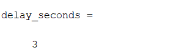
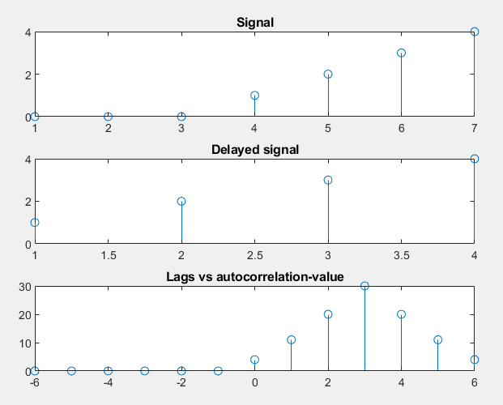
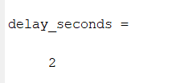
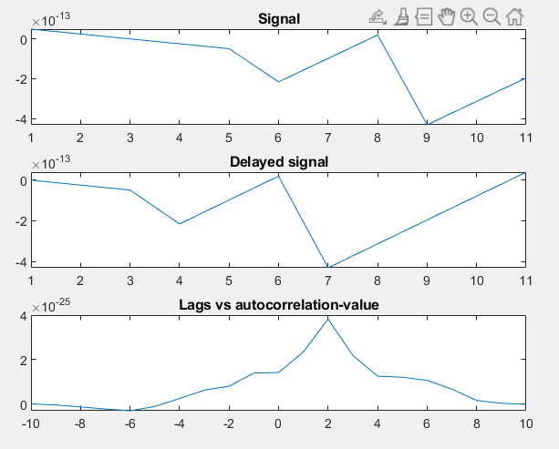
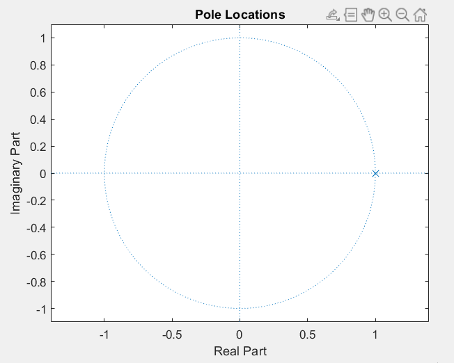

## Experiment Date : 14/05/23

## Experiment No : 04

## Experiment Name :

## Experiment on finding delay of a function and plotting poles and zeros of the z-transform of a function.

---

## Theory :

<p align='justify'>
In digital signal processing, a delay refers to a time-shift or phase-shift applied to a signal. It's a fundamental operation used to shift the signal's entire waveform in time, either forward or backward. Delaying a signal can have various effects on its characteristics, such as time alignment, synchronization, or achieving specific processing goals. Mathematically, the effect of delaying a discrete-time signal x[n] by a certain number of samples (k) can be represented as:
y[n] = x[n - k]
Where:
y[n] is the delayed output signal.
x[n] is the original input signal.
k is the number of samples by which the signal is delayed.
Poles and zeros are properties associated with the transfer function of a system. The transfer function describes the relationship between the input and output signals of a linear time-invariant (LTI) system. In the Z-transform domain, the transfer function is represented as a rational function of the Z variable.

</p>

<br>

## Software Used:

> Matlab

</br>
## Code: 
## Delay of discrete signal:

```matlab
1.	clc;
2.	clear all;
3.	close all;
4.	x=[0 0 0 1 2 3 4];
5.	x1=[1 2 3 4];
6.	[autocorr, lags] = xcorr(x,x1)
7.	subplot(3,1,1);
8.	stem(x);
9.	title('Signal');
10.	subplot(3,1,2);
11.	stem(x1);
12.	title('Delayed signal');
13.	subplot(3,1,3);
14.	stem(lags,autocorr);
15.	title('Lags vs autocorrelation-value');
16.	[~, index] = max(autocorr);
17.	delay_sample = abs(lags(index))
18.	Fs=1;
19.	delay_seconds = delay_sample/Fs


```

## Delay of continuous signal:

```matlab
1.	clc;
2.	clear all;
3.	close all;
4.	t= 0:1:10;
5.	f=10;
6.	x=10*sin(2*f*pi*(t-2));
7.	x1=10*sin(2*f*pi*t);
8.	plot(xcorr(x,x1));
9.	z=xcorr(x,x1);
10.	[autocorr, lags] = xcorr(x,x1)
11.	subplot(3,1,1);
12.	plot(x);
13.	title('Signal');
14.	subplot(3,1,2);
15.	plot(x1);
16.	title('Delayed signal');
17.	subplot(3,1,3);
18.	plot(lags,autocorr);
19.	title('Lags vs autocorrelation-value');
20.	[~, index] = max(autocorr);
21.	delay_sample = abs(lags(index))
22.	Fs=1;
23.	delay_seconds = delay_sample/Fs


```

## Plotting poles and zeros:
```matlab
1.	% Define the transfer function coefficients
2.	b = [0 1];
3.	a = [1 -1];
4.	 
5.	% Create the transfer function object
6.	H = tf(b, a, 1);
7.	 
8.	% Display the transfer function
9.	disp('Transfer Function:');
10.	disp(H);
11.	 
12.	% Obtain the poles of the transfer function
13.	poles = pole(H);
14.	 
15.	% Display the poles
16.	disp('Poles:');
17.	disp(poles);
18.	 
19.	% Plot the poles on the z-plane
20.	figure;
21.	zplane([], poles);
22.	title('Pole Locations');


```

## Output:
## For Discrete Signal:



**Fig.4.1** : Delay of The Discrete Function.

## Plot:


**Fig.4.2** : Delay of The Discrete Function.

## For Continuous Signal:


**Fig.4.3** : Delay of The Continuous Function.

## Plot:


**Fig.4.4** : Delay of The Continuous Function.

## Plotting Poles And Zeros:


**Fig.4.5** : Poles and zeros of the transfer function.

</br>
</br>

## Discussion:

<div align='justify'>

Firstly, the signal delay was calculated. Both the discrete and continuous signals' delays was computed. Secondly, A signal's z-transform's poles and zeros has been plotted using MATLAB. 

</div>

</br>

## Conclusion:

<div align='justify'>

The experiment had been done successfully without any issue.

</div>